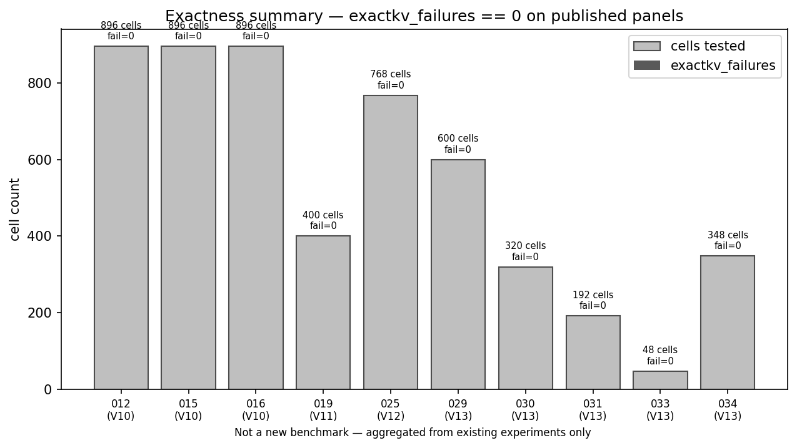
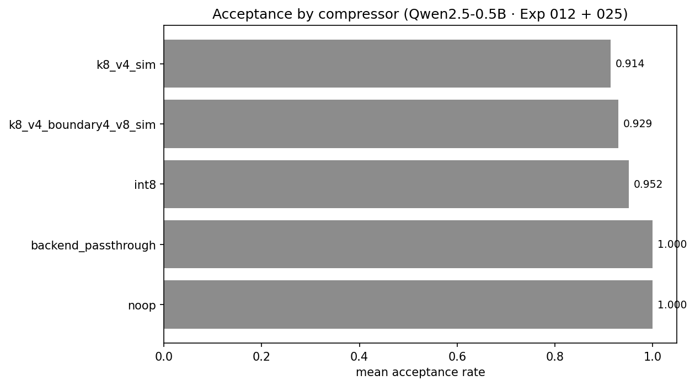
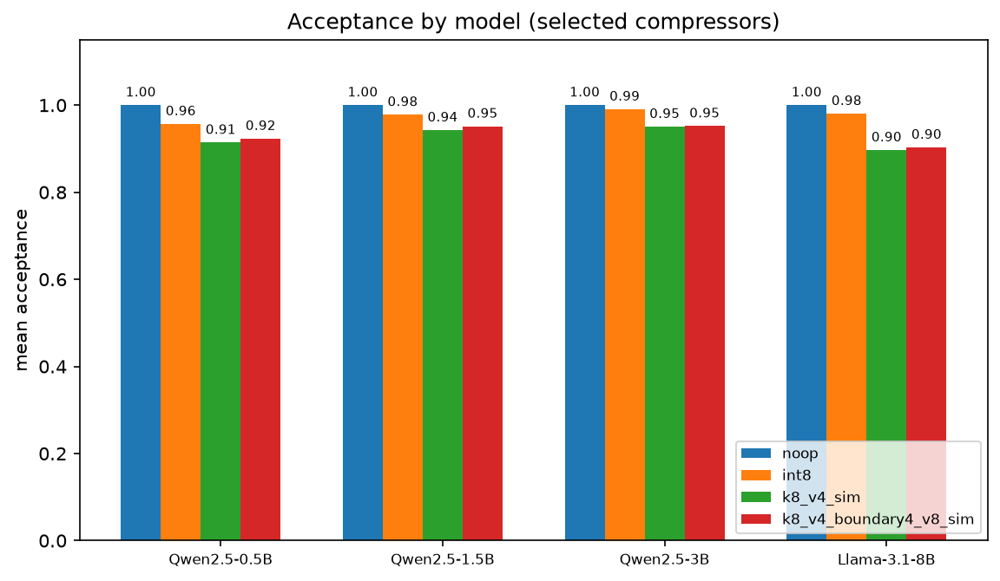
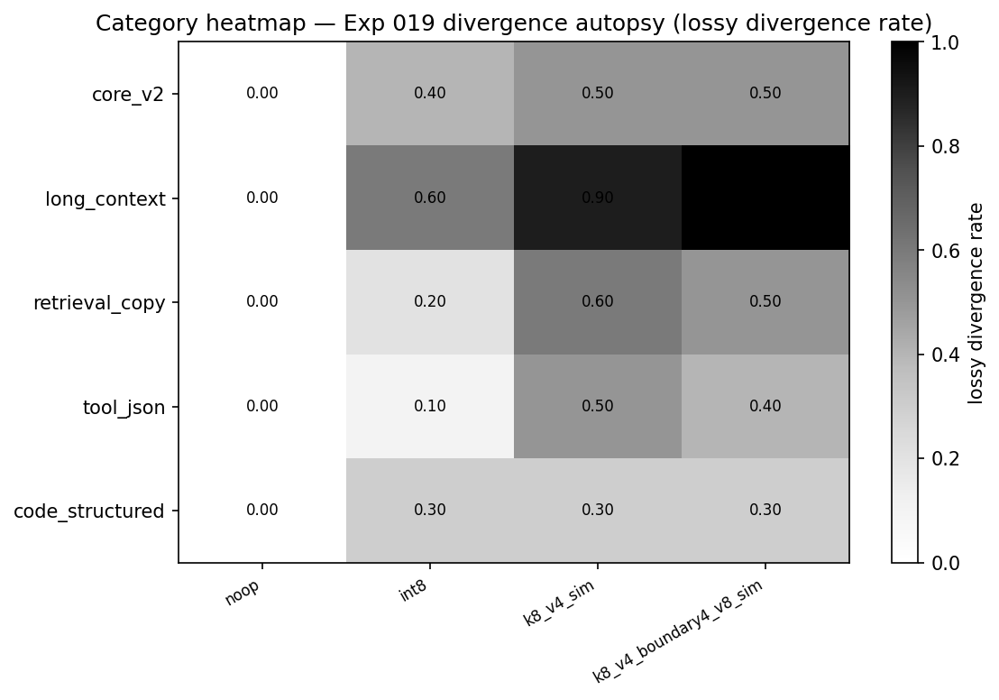
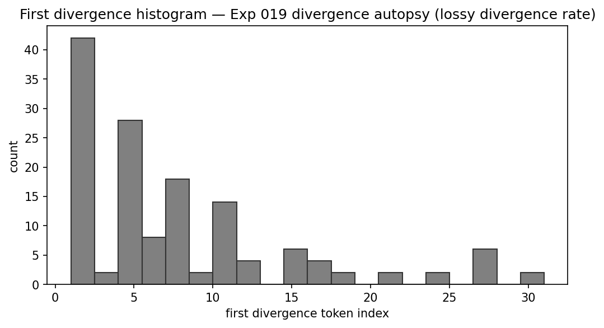
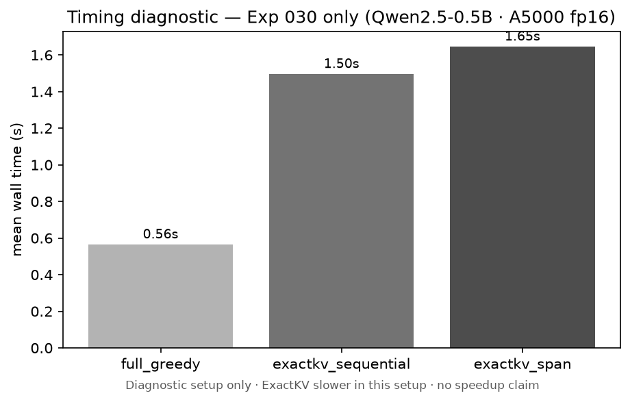
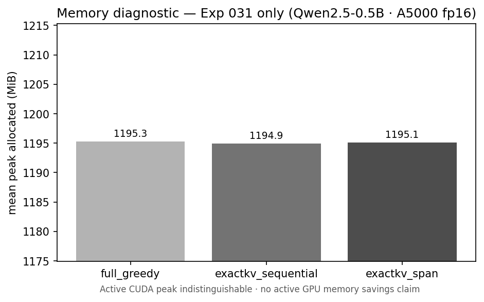
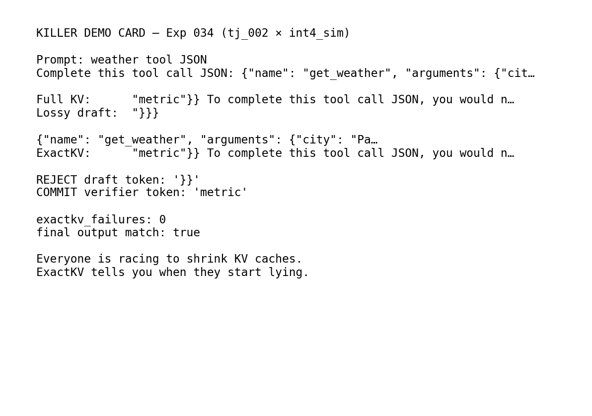

# Experiment 035: Visual Plots and Mini Leaderboard

_Generated by `scripts/visualize_experiment_035.py` on 2026-06-26. V13 Phase 8 — visualization only._

> This is a **visualization/reporting phase** using existing results, not a new benchmark.
> No speedup, throughput, latency, runtime, tokens/sec, active GPU memory savings, production serving, or model accuracy improvement claim is made.
> Timing numbers are **diagnostic only** from Exp 030.
> Memory numbers are **diagnostic only** from Exp 031.
> External Shard/SpectralQuant/SnapKV paper results are **not** ExactKV results.
> ExactKV does **not** improve the model's underlying accuracy; it preserves full-greedy output while using lossy KV only as a draft.

---

## 1. Purpose

Turn existing V10–V13 ExactKV results into a polished visual package and mini leaderboard — a KV-compression crash-test lab narrative.

> **Everyone is racing to shrink KV caches. ExactKV tells you when they start lying.**

## 2. Inputs used

- `reports/experiment_012_eval_suite_expansion.csv`
- `reports/experiment_015_qwen15b_v10_suites.csv`
- `reports/experiment_016_qwen3b_v10_suites.csv`
- `reports/experiment_019_divergence_autopsy.csv`
- `reports/experiment_025_full_suite_repair_policy.csv`
- `reports/experiment_029_span_verification_grid.csv`
- `reports/experiment_030_diagnostic_timing.csv`
- `reports/experiment_031_gpu_memory_isolation.csv`
- `reports/experiment_033_llama31_8b_small_suite.csv`
- `reports/experiment_034_killer_correction_demo.json`

## 3. Generated assets

















## 4. Exactness summary

| Exp | Phase | Cells | exactkv_failures |
| --- | --- | ---: | ---: |
| 012 | V10 | 896 | 0 |
| 015 | V10 | 896 | 0 |
| 016 | V10 | 896 | 0 |
| 019 | V11 | 400 | 0 |
| 025 | V12 | 768 | 0 |
| 029 | V13 | 600 | 0 |
| 030 | V13 | 320 | 0 |
| 031 | V13 | 192 | 0 |
| 033 | V13 | 48 | 0 |
| 034 | V13 | 348 | 0 |

V13 highlights: Exp 029 (600), 030 ExactKV arms (320), 031 (192 ExactKV), 033 (48), 034 search (348). Do not overgeneralize beyond tested cells.

## 5. Mini leaderboard (tiered)

ExactKV Leaderboard ranks integrated compressors by token-level acceptance and exactness. Restricted backends (including Shard external-drafter probe results), smoke-only adapters, and future candidates are separated to avoid apples-to-oranges claims.

See [`leaderboard.md`](leaderboard.md) — **FULL PANEL**, **RESTRICTED BACKEND**, **SMOKE ONLY**, **FUTURE CANDIDATE**, and **REPAIR POLICY** sections.

## 6. Acceptance visuals

- **By compressor:** Qwen2.5-0.5B mean across Exp 012 + 025.
- **By model:** Exp 012 / 015 / 016 / 033 panels for selected compressors.

## 7. Divergence visuals

- **Category heatmap:** Exp 019 divergence autopsy (lossy divergence rate).
- **First divergence histogram:** Exp 019 divergence autopsy (lossy divergence rate).

## 8. Timing visual

Exp 030 diagnostic only — ExactKV sequential and span arms slower than full greedy on A5000 fp16. **No speedup claim.**

## 9. Memory visual

Exp 031 diagnostic only — peak active CUDA allocation indistinguishable across arms at 0.5B scale. **No active GPU memory savings claim.**

## 10. Killer demo visual/card

Exp 034 `tj_002` weather JSON — lossy `}}` rejected, verifier `metric` committed. Live terminal replay: [`DEMO_EXACTKV_LIVE_CORRECTION.md`](DEMO_EXACTKV_LIVE_CORRECTION.md).

## 11. Public-facing narrative

Everyone is racing to shrink KV caches.
ExactKV tells you when they start lying.

ExactKV is a correctness-first crash-test lab for lossy KV drafts: when compression starts lying, the full-KV verifier catches it and preserves greedy output.

## 12. What this proves

- Published panels maintain `exactkv_failures == 0` on tested cells.
- Acceptance and divergence vary by compressor, model, and category — visible in plots.
- Diagnostic timing/memory charts document constraints without launch headlines.

## 13. What this does not prove

- No speedup, throughput, latency, tokens/sec, or VRAM savings.
- No production serving or model accuracy improvement.
- Leaderboard lists Shard as restricted external-drafter probe (Exp 039–041), not integrated compressor.

## 14. Limitations

- Plots reflect available local reports; missing JSON/CSV uses fixtures or skips.
- SnapKV experimental is smoke-only (8 cells).
- Llama panel is a 12-prompt small suite (Exp 033).

## 15. Next steps

**Proceed to Phase 9** — V13 completion / launch decision package (headline audit, readiness assessment).

## Reproduction

```bash
python3 scripts/visualize_experiment_035.py
```
